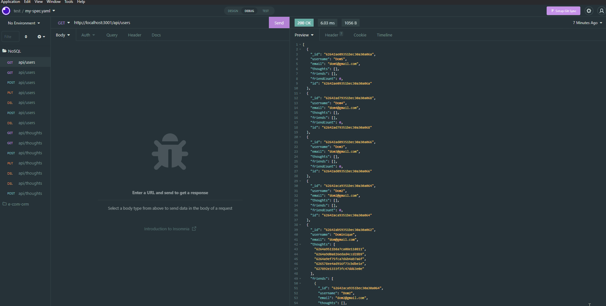

# NoSQL-API

## Table of Contents

- [Description](#Description)
- [Deployment](#Deployment)

## Description

With NoSQL GET, POST, PUT, and Delete routes this app can use a database to display data about anything a user inputs. The models can validate these entries before they are uploaded to the database.

## Deployment

## Contact Me

- dominiqued.akers@gmail.com
- https://www.linkedin.com/in/dominique-akers-319a07154/
